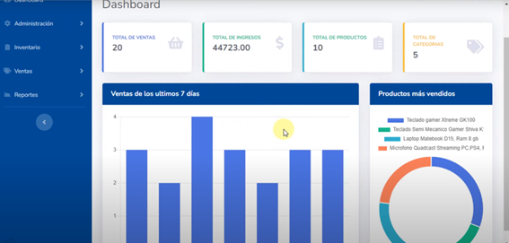
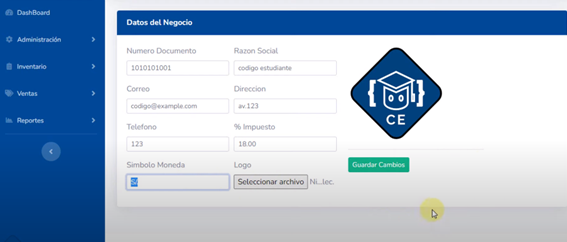
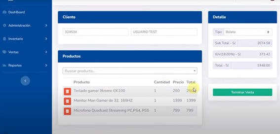

# Sistema de Facturación

Este repositorio contiene un sistema de facturación desarrollado utilizando tecnologías como C#, ASP.NET, SQL Server, JavaScript y Entity Framework. El sistema está diseñado para gestionar el proceso de facturación, incluyendo la creación de facturas, gestión de clientes, seguimiento de productos y otras funciones relacionadas.

## Características

- **Gestión de Facturas**: Permite la creación, edición y eliminación de facturas.
- **Gestión de Clientes**: Facilita la administración de información sobre clientes.
- **Seguimiento de Productos**: Permite mantener un inventario actualizado de productos.
- **Base de Datos SQL Server**: Utiliza SQL Server para el almacenamiento de datos.
- **Entity Framework**: Se utiliza Entity Framework para el acceso y manipulación de datos en la base de datos.
- **Interfaz de Usuario Amigable**: Diseño de interfaz de usuario intuitivo y fácil de usar.

## Tecnologías Utilizadas

- **C#**: Lenguaje de programación principal para la lógica del sistema.
- **ASP.NET**: Marco de trabajo para el desarrollo de aplicaciones web.
- **SQL Server**: Sistema de gestión de bases de datos relacional.
- **JavaScript**: Utilizado para mejorar la interactividad en el lado del cliente.
- **Entity Framework**: ORM (Mapeo Objeto-Relacional) para la manipulación de datos.

## Configuración del Proyecto

1. **Clonar el Repositorio**:

   ```bash
   git clone https://github.com/johanariel/SistemaFacturacionGrupo4.git
   ```
## Capturas de Ejecución




